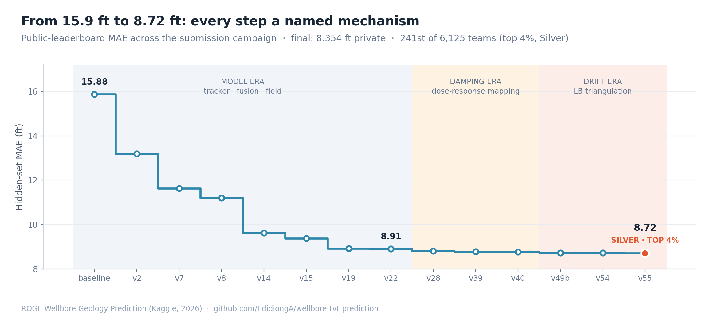
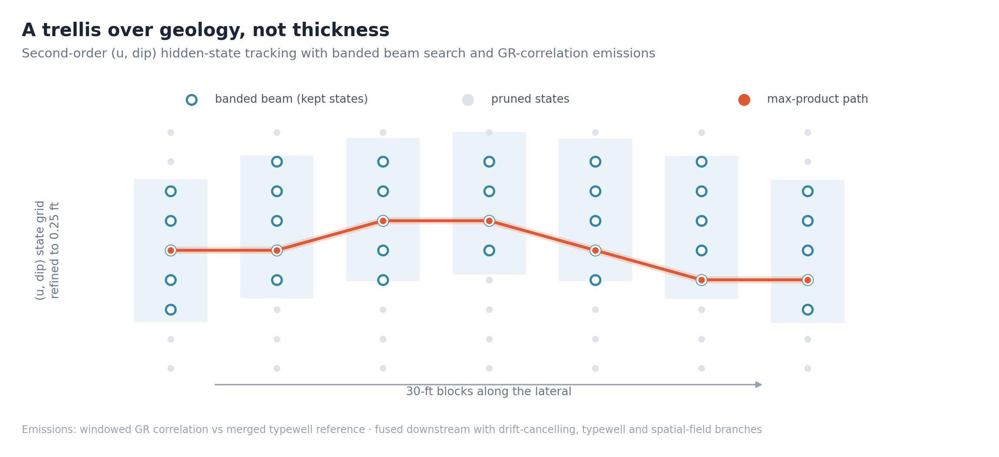
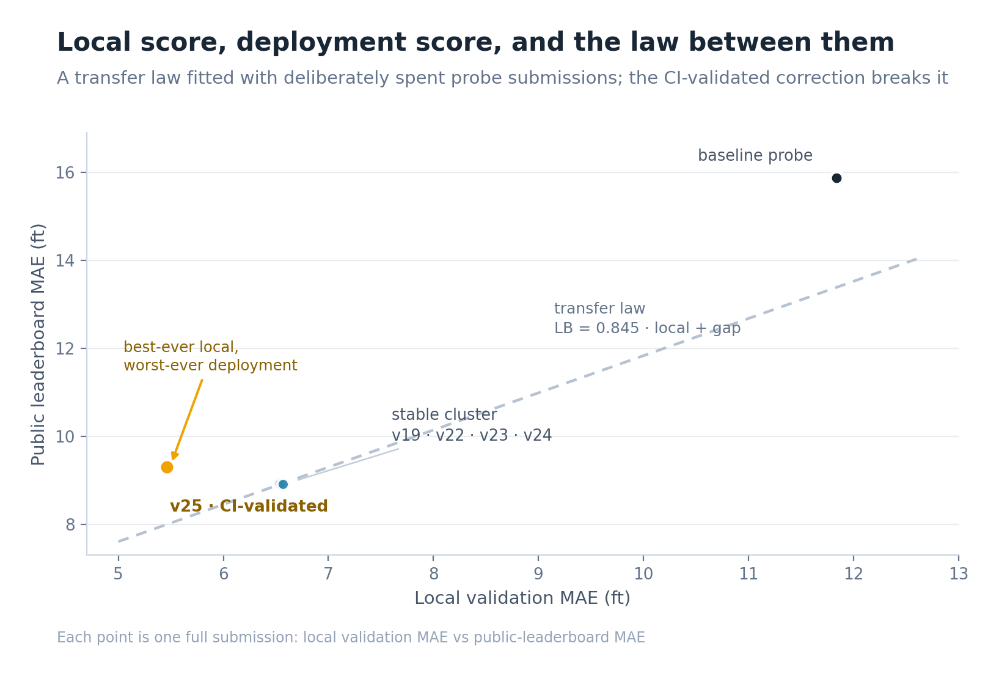
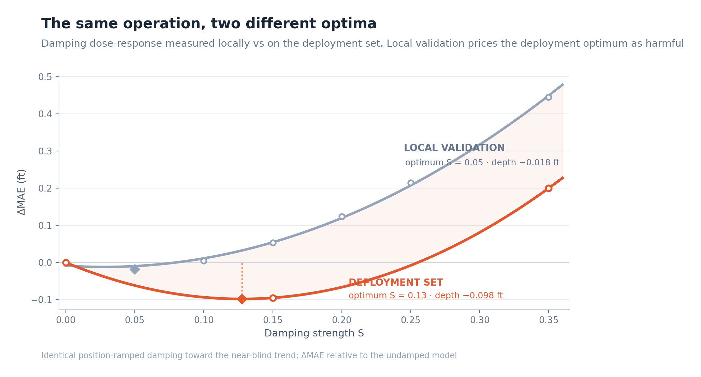
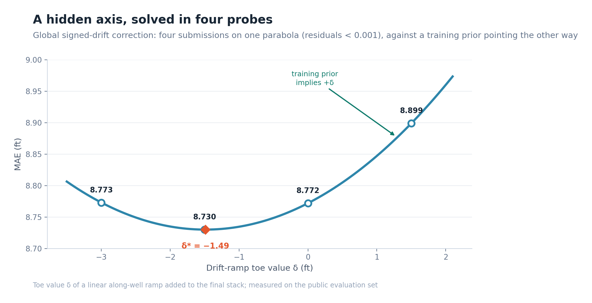
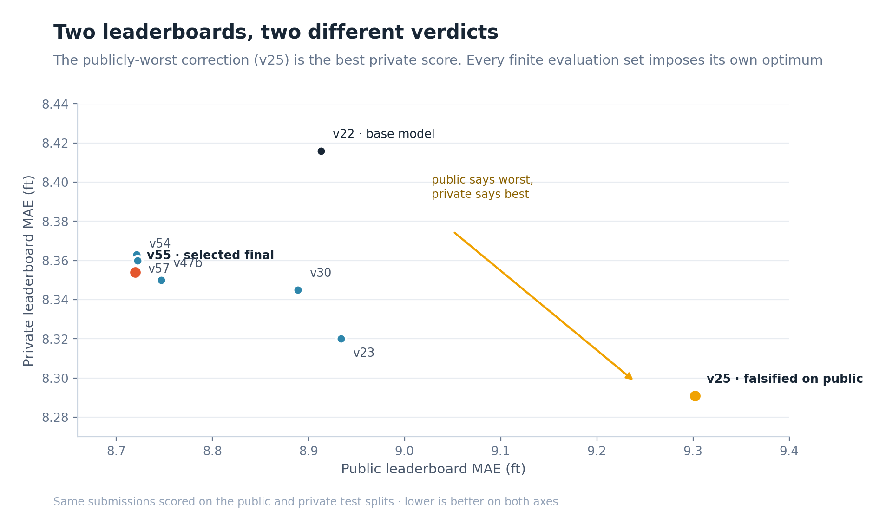

<div align="center">

# Blind-Zone TVT Prediction in Horizontal Wells

**A structural-coordinate tracker with deployment-side dose calibration, and a three-way study of why leaderboards disagree**

[](https://www.kaggle.com/competitions/rogii-wellbore-geology-prediction)


[](LICENSE)

**Edidiong-Abasi Anwanane** · [Kaggle competition](https://www.kaggle.com/competitions/rogii-wellbore-geology-prediction) · [Preprint (PDF)](papers/rogii_preprint_Anwanane.pdf) · arXiv link forthcoming

</div>

---

Geosteering is the practice of keeping a horizontal well inside its target zone while drilling. It depends on knowing the well's geological position in the stretch where direct interpretation runs out: the blind zone, which covers roughly 75% of every lateral. Horizontal wells produce about 94% of U.S. crude oil, so this prediction problem sits underneath nearly all of it.

This repository contains a complete solution built in four weeks of participation. It finished in the top 4% of 6,125 teams and rose 3,039 places when the private leaderboard was revealed, as an overfit public tier collapsed. That collapse was predicted in writing before the reveal; the analysis is in Section 10 of the preprint.

<div align="center">



</div>

## Results

| | Public LB | Private LB |
|---|:---:|:---:|
| Constant-continuation baseline | 15.88 | not scored |
| Base model (v22: tracker + fusion + field) | 8.913 | 8.416 |
| **Final (v55: base + calibrated regularization stack)** | **8.720** | **8.354** |

A 45% error reduction, with every step attributed to a single named mechanism. The full ledger, including every falsified idea, lives in [`docs/campaign_log.md`](docs/campaign_log.md).

## The method

The first move is a change of coordinates. Predicting thickness (TVT) directly is hard because the signal is dominated by wellbore geometry. Adding the known well path gives a structural coordinate, u = TVT + Z, which is smooth geology. That single reparameterization turns a noisy regression problem into a tracking problem.

<div align="center">

</div>

A second-order hidden-state tracker follows (u, dip) through a banded trellis: 30-foot blocks, coarse-to-fine refinement down to 0.25 ft, and emissions from windowed gamma-ray correlation against a merged typewell reference. Its output is fused, station by station, with drift-cancelling, typewell-anchored, and spatial-field branches, weighted by the inverse variance of their live disagreement. The whole pipeline runs on one CPU core at about 4 seconds per well and needs no offset logs.

## Three findings worth stealing

**1. Validation is an instrument you can point at deployment.** Submissions were spent deliberately as measurements. A handful of probes fit a transfer law linking local validation scores to leaderboard scores, and departures from that law diagnose mechanisms rather than just rank them. The correction that broke the law had the best local score of its era, with a full confidence-interval validation behind it, and produced the worst deployment score:

<div align="center">

</div>

**2. Deployment-side optima are displaced from local ones.** Four regularization axes were dose-response mapped directly against the evaluation set: damping strength, high-frequency shrinkage, drift dose, and drift profile. Each shows a clean interior optimum, and each optimum sits at a dose that local validation prices as harmful:

<div align="center">


</div>

**3. Every finite evaluation set imposes its own optimum.** The same submissions ended up scored three ways: local cross-validation, the public leaderboard, and the private leaderboard. The orderings disagreed twice over. A correction falsified on the public split turned out to be the best private score of all. The only mechanisms that transferred across all three splits were the ones grounded in problem structure; everything finely tuned to one split inherited that split's fingerprint:

<div align="center">

</div>

## Repository layout

| Path | Contents |
|---|---|
| [`model/`](model) | Tracker notebooks (final base: `rogii_tvt_tracker_v22.ipynb`) plus leave-one-well-out instrumentation |
| [`neural/`](neural) | The sequence-model line: 1D U-Net, then a BiGRU with five-fold OOF, plus the tracker/BiGRU join analysis |
| [`postprocessing/`](postprocessing) | The submission campaign v25 through v58, one mechanism per file |
| [`diagnostics/`](diagnostics) | Local instruments (L1 to L8), drift, anchor and slope probes, exploitability tests |
| [`papers/`](papers) | Preprint PDF and manuscript sources for the journal, URTeC, EAGE and IMAGE versions |
| [`docs/`](docs) | The full campaign log: every submission, its mechanism, and its public and private scores |

## Data

Competition data is not redistributed here, in line with the competition's data-use rules. To run the notebooks, join the [competition](https://www.kaggle.com/competitions/rogii-wellbore-geology-prediction) and attach its dataset on Kaggle. The notebooks are written for that environment (CPU, internet off).

## Citing

```bibtex
@misc{anwanane2026tvt,
  author = {Anwanane, Edidiong-Abasi},
  title  = {Blind-Zone TVT Prediction in Horizontal Wells: An Information-Ceiling
            Study with Deployment-Side Dose Calibration},
  year   = {2026},
  note   = {Preprint. Code: https://github.com/EdidiongA/wellbore-tvt-prediction}
}
```

## License

Code is released under the [MIT License](LICENSE). Papers and figures are copyright 2026 Edidiong-Abasi Anwanane; the preprint is distributed under CC BY 4.0 via arXiv.
